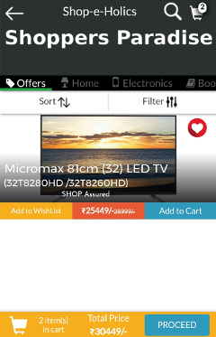
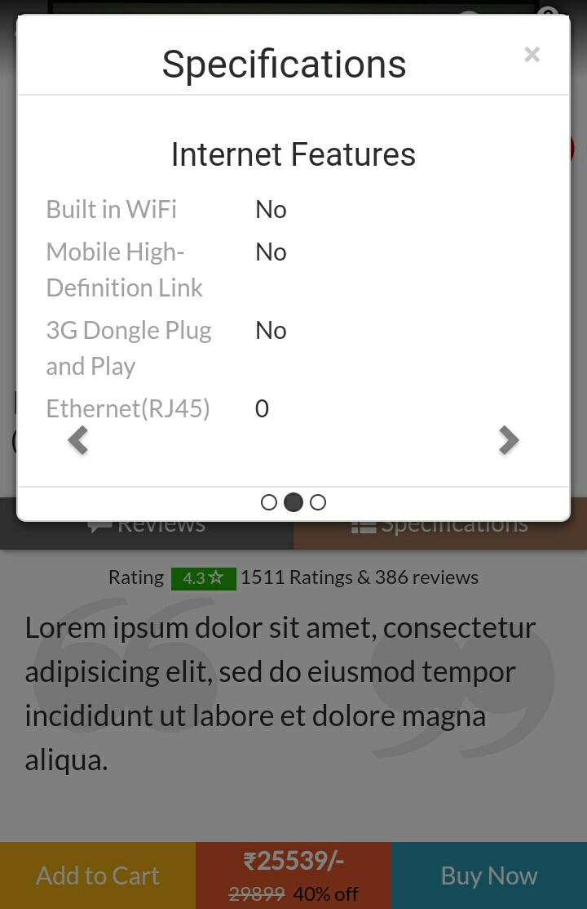
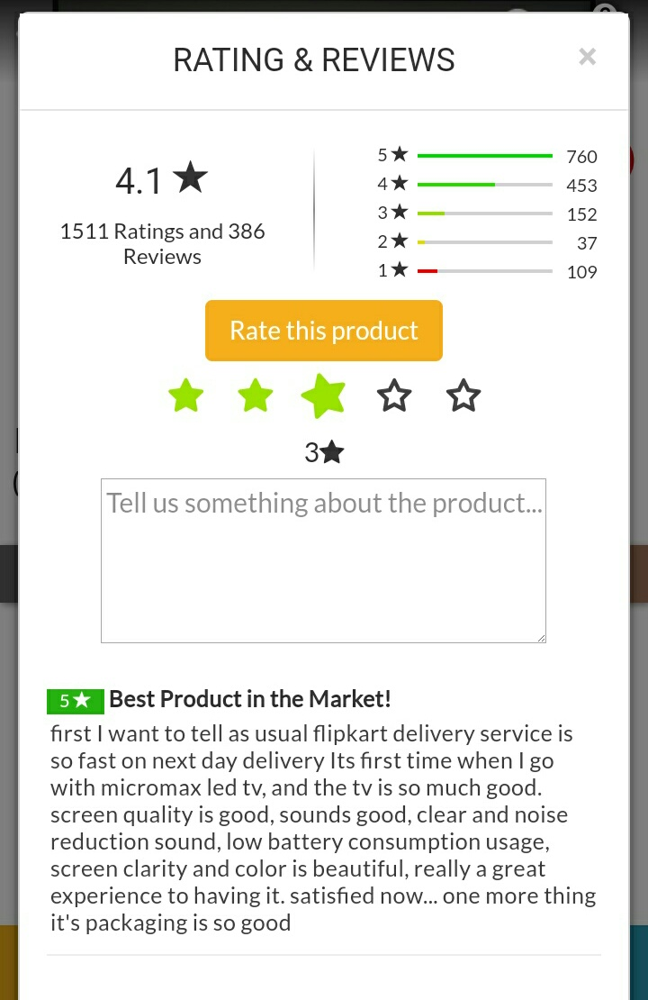
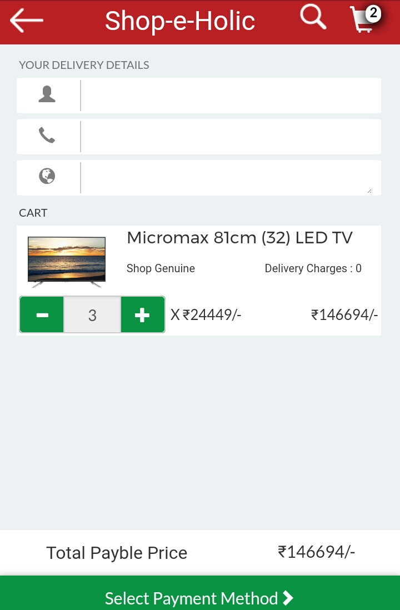

# mobile-only-ecom
A mobile only UI with seamless UX for an E-commerce business.Everything in the page has been coded from scratch
A sleek UI with various features according to the need of the customer.The main things that the customer wants so see ahs been included on the main page where as the things the customer doesnt cosider so much worthy have been placed in a bootstrap modal.

[Visit the page here](https://sarthakagarwal22.github.io/mobile-only-ecom/)

How the Product Page Looks 

On clicking back icon on the top we view the category page

On clicking the Description button on the product page we see this carousel

On clicking the Reviews button on the product page we see this design

On clicking the Cart Icon on any page or Buy Now on the product page we reach cart page

There are several other minial animations that helps in making the page feel better.
